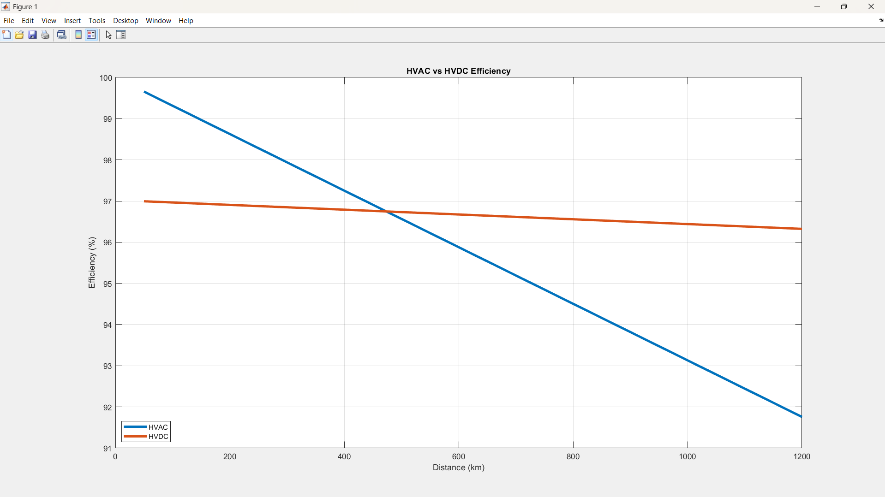
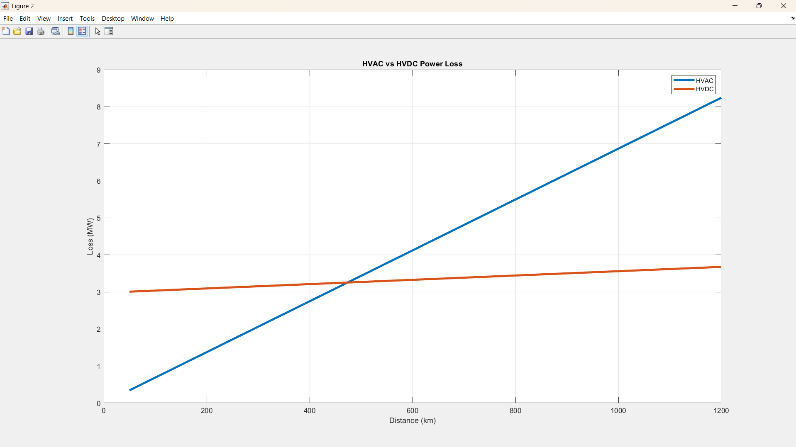

# 1. HVAC vs HVDC Transmission Analysis

A MATLAB-based power systems project that compares the performance of **HVAC (High Voltage Alternating Current)** and **HVDC (High Voltage Direct Current)** transmission systems over long distances.

The project evaluates:

* Transmission Efficiency
* Power Losses
* Break-Even Distance
* Impact of Converter Stations
* Long-Distance Power Transfer Performance

---

## 2. Project Objective

The objective of this project is to analyze how transmission distance affects HVAC and HVDC systems and determine the distance at which HVDC becomes more efficient than HVAC.

---

## ⚙️ System Parameters

| Parameter            | Value           |
| -------------------- | --------------- |
| Load Power           | 100 MW          |
| HVAC Voltage         | 220 kV          |
| HVDC Voltage         | 500 kV          |
| Power Factor         | 0.95            |
| Distance Range       | 50 km – 1200 km |
| HVAC Resistance      | 0.04 Ω/km       |
| HVDC Resistance      | 0.015 Ω/km      |
| Rectifier Efficiency | 98.5%           |
| Inverter Efficiency  | 98.5%           |

---

## 3. Methodology

### HVAC Transmission

HVAC current is calculated using:

```math
I_{AC} = \frac{P}{\sqrt{3}V_{AC}pf}
```

Power loss:

```math
P_{loss,AC}=3I_{AC}^{2}R
```

Efficiency:

```math
\eta_{AC}=\frac{P_{received}}{P_{load}}\times100
```

---

### HVDC Transmission

HVDC current:

```math
I_{DC}=\frac{P}{V_{DC}}
```

Line loss:

```math
P_{loss,DC}=I_{DC}^{2}R
```

Converter efficiency:

```math
\eta_{converter}=\eta_{rectifier}\times\eta_{inverter}
```

Overall received power:

```math
P_{received}=(P_{load}-P_{loss,DC})\times\eta_{converter}
```

---

## 4. Results

The simulation shows that:

* HVAC efficiency decreases significantly with distance.
* HVDC maintains relatively stable efficiency.
* Converter station losses affect HVDC at short distances.
* HVDC becomes more efficient after approximately **500 km**.

---

## 5. Efficiency Comparison



---

## 6. Power Loss Comparison



---

## 7. Sample Output

| Distance (km) | HVAC Efficiency (%) | HVDC Efficiency (%) |
| ------------- | ------------------- | ------------------- |
| 50            | 99.66               | 96.99               |
| 250           | 98.28               | 96.88               |
| 500           | 96.57               | 96.73               |
| 800           | 94.51               | 96.56               |
| 1200          | 91.76               | 96.32               |

---

## 8. How to Run

1. Open MATLAB.
2. Navigate to the project folder.
3. Run:

```matlab
power_line_ac_dc
```

The script will:

* Calculate HVAC and HVDC losses
* Calculate transmission efficiency
* Generate comparison plots
* Display results table
* Determine break-even distance

---

## 9. Software Used

* MATLAB
* Git
* GitHub

---

## 10. Applications

* Power System Analysis
* Electrical Engineering Education
* HVDC Transmission Studies
* Smart Grid Research
* Renewable Energy Integration
* Transmission Planning

---

## 11. If you found this project useful

Please consider starring the repository and sharing it with others interested in Power Systems and MATLAB simulations.
